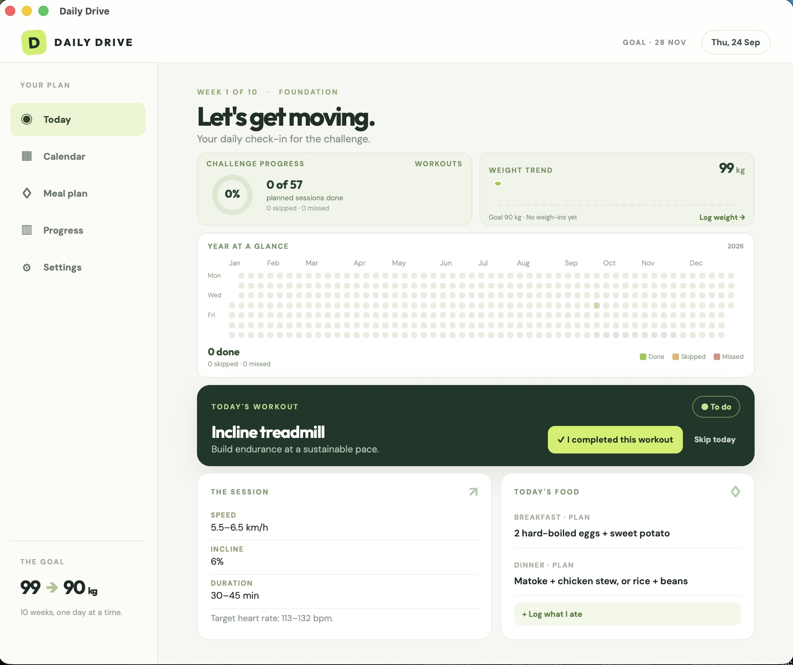

# Daily Drive

A personal workout and meal planning companion for macOS, Windows, and Linux. Built with Tauri 2, Rust, React, and TypeScript.



## What it does

- Guides new users through a personal goal, timeline, workout schedule, and meal plan.
- Lets users edit their repeating workout and meal plans or make date-specific changes.
- Shows the day's planned workout and meals alongside separately logged actual workouts and food.
- Shows a circular workout completion percentage, weight trend, and full-challenge day grid on Today.
- Includes a calendar of workouts and a weekly meal plan.
- Plays a repeating desktop alarm and raises an always-on-top window at the chosen time on scheduled workout days.
- Stops the alarm when you complete or deliberately skip today's workout.
- Counts unmarked workout days as missed from the date tracking began. Earlier days stay untracked. The Progress screen lets you correct a day later.
- Logs actual workouts, breakfast, lunch, dinner, and snacks separately from the planned schedule.
- Tracks weight, waist, and workouts over time. The current weight comes from the latest weigh-in.
- Lets you edit starting weight, target weight, and challenge dates in Settings; schedules are managed in Plan.
- Saves progress locally in the app data folder.
- Exports and imports plan and history as JSON. Imports merge dated records and save an automatic pre-import backup.
- Launches at login when the installed release app runs. You can turn this off in Alarm settings.

The default alarm is **7:00 AM**. Change it in the app. Your computer must be awake, the app must be running, and system volume must be audible. Closing the window keeps the app running; choosing Quit from the app menu stops the alarm. A skip silences the alarm for that day; it does not erase your history.

## Run from source

```sh
npm install
npm run tauri dev
```

## Build the desktop app

```sh
npm run tauri build -- --bundles app
```

Tauri creates platform-native app bundles under `src-tauri/target/release/bundle`. Build on the target operating system for the most reliable installers. No cloud account is needed.

## Publish a release

GitHub Actions builds macOS, Windows, and Linux installers when a `v*` version tag is pushed. Rust build output is cached between releases. The app checks GitHub Releases from **Settings → App updates** and installs updates signed by the Tauri updater key.

Set all four project versions together, commit them, and push a matching tag:

```sh
npm run version:set -- 0.1.1
git add package.json package-lock.json src-tauri/tauri.conf.json src-tauri/Cargo.toml
git commit -m "Release v0.1.1"
git tag v0.1.1
git push origin main --tags
```

See [docs/releases.md](docs/releases.md) for the one-time GitHub and Apple setup, credential sources, and the release checklist.
